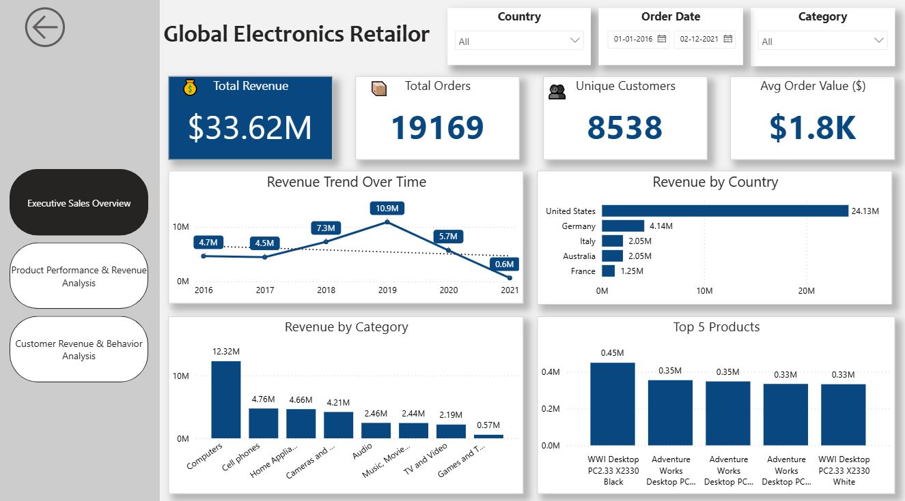
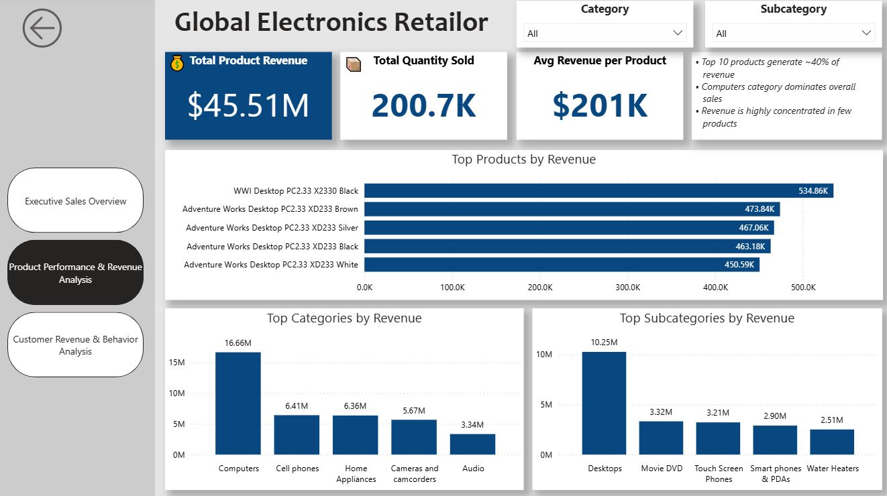
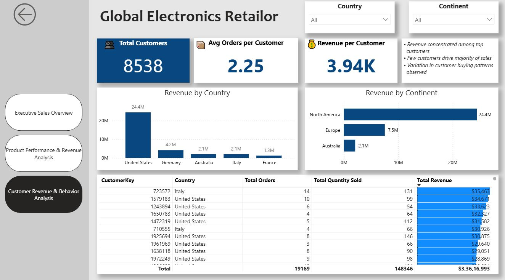

# 📊 Global Electronics Retail Dashboard

## 🚀 Project Overview
This project presents an end-to-end data analytics solution built using Power BI, SQL, and Excel. The objective was to transform raw retail data into meaningful insights that support business decision-making.

The dashboard is structured into three key analytical sections:
- Executive Sales Overview  
- Product Performance & Revenue Analysis  
- Customer Revenue & Behavior Analysis  

---

## 🧩 Data Preparation & Cleaning (Excel)

The initial dataset contained inconsistencies and formatting issues that required preprocessing before analysis.

Key data cleaning steps:
- Removed duplicate and unnecessary records  
- Handled missing/null values  
- Standardized column formats (e.g., dates, currency)  
- Converted date fields into proper SQL-compatible format (YYYY-MM-DD)  
- Ensured consistent naming conventions across datasets  
- Verified data integrity and corrected anomalies  

Excel was used as the first stage to ensure clean and structured data before loading it into the database.

---

## 🗄 Database Creation & Data Modeling (SQL)

A relational database was designed and implemented using MySQL.

### Key steps:
- Created database schema: `electronics_retail`  
- Designed structured tables:
  - Customers  
  - Products  
  - Sales  
  - Stores  
  - Exchange Rates  

- Defined appropriate data types (INT, VARCHAR, DATE, DECIMAL)  
- Resolved data type issues (e.g., increasing VARCHAR length for StateCode)  
- Imported cleaned CSV data into respective tables  
- Ensured referential consistency using keys (CustomerKey, ProductKey, etc.)

---

## 🔗 Data Integration with Power BI

After preparing the database:

- Connected MySQL data to Power BI (via ODBC / CSV approach)  
- Imported structured datasets into Power BI  
- Established relationships between tables:
  - Sales ↔ Customers  
  - Sales ↔ Products  

- Created a data model optimized for analysis  

---

## 📊 Dashboard Development (Power BI)

Developed a 3-page interactive dashboard:

### 1️⃣ Executive Sales Overview
- Total Revenue, Orders, Customers, Avg Order Value  
- Revenue trends over time  
- Revenue by country and category  

---

### 2️⃣ Product Performance & Revenue Analysis
- Top-performing products  
- Revenue distribution by category and subcategory  
- Identification of high-revenue product segments  

---

### 3️⃣ Customer Revenue & Behavior Analysis
- Customer-level revenue insights  
- Revenue distribution across regions  
- Identification of high-value customers  

---

## 📈 Key Insights
- Revenue is highly concentrated among a small group of products and customers  
- Computers category contributes the highest share of total revenue  
- Top customers significantly influence overall sales performance  
- Sales distribution varies across regions, with the United States leading  

---

## 🛠 Tools & Technologies
- Power BI (Data Visualization & Dashboarding)  
- MySQL (Database & Data Modeling)  
- Excel (Data Cleaning & Preprocessing)  

---

## 🎯 Features
- Interactive slicers (Country, Category, Date)  
- KPI-driven dashboard design  
- Conditional formatting for better insights  
- Clean and professional UI/UX layout  

---

## 💡 Learnings
- End-to-end data pipeline development  
- Data cleaning and transformation techniques  
- Relational database design and SQL querying  
- Building business-focused dashboards using Power BI  
- Effective data storytelling  

---

## 📊 Dashboard Preview

### 1️⃣ Executive Sales Overview

### 2️⃣ Product Performance

### 3️⃣ Customer Analysis

